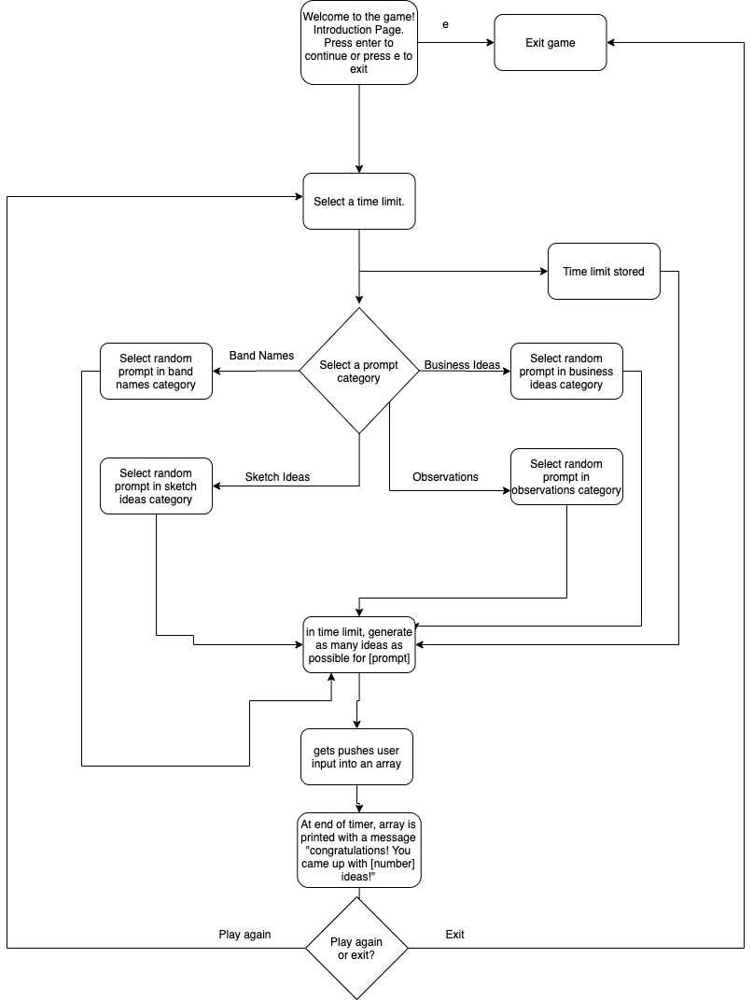
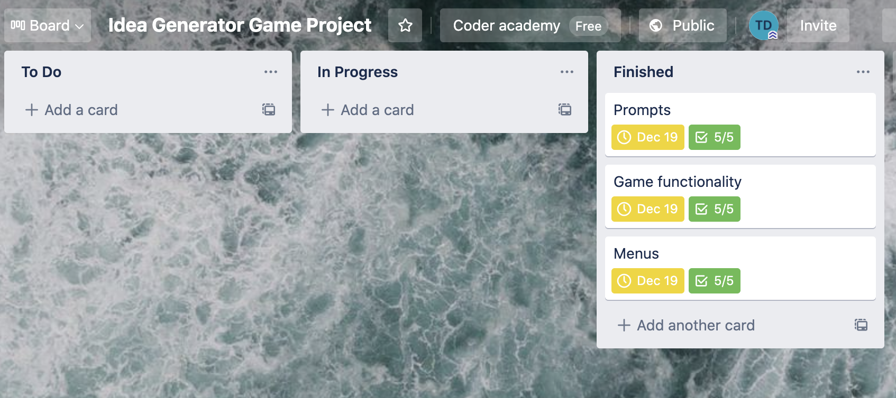
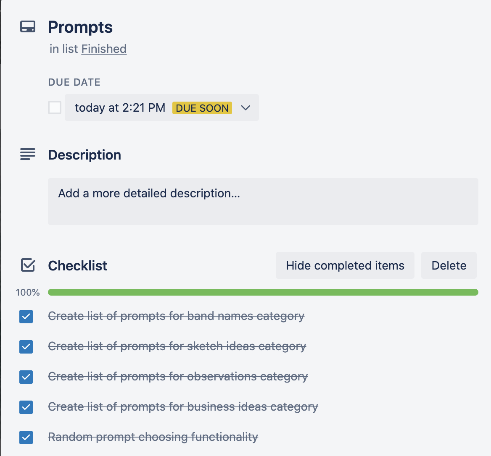
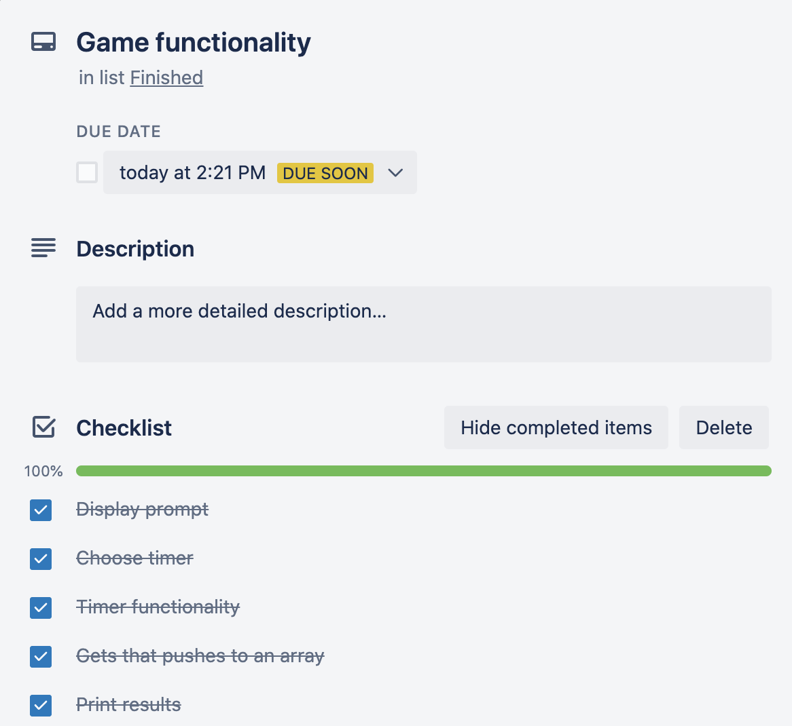
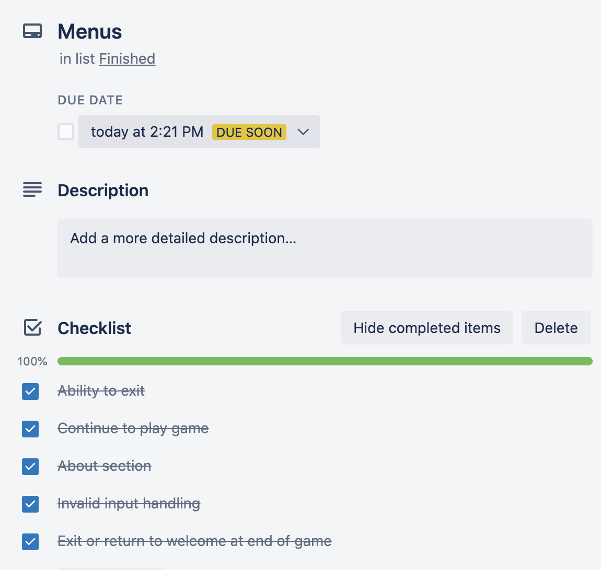

# Idea Generation Game

A game to help workout the idea generation part of the brain.

## How to Install and Use
### Dependencies
* Ruby

### To install and run
* Run install-run.sh in your terminal

or

* $ gem install bundler
* $ bundle install
* $ ruby index.rb

## Source Control Repository
[Link to Github](https://github.com/TimothyDunk/idea-generation-game)

## Purpose and Scope
Idea generation is a skill that can be trained. This app is designed to be a simple, fun game to train that part of the brain. 

The aim of the program is to create a low risk, enjoyable environment to test and develop your idea generation skills. In my experience, the best way to improve your idea generation is by placing restrictions, e.g. a time limit, that require you to not filter yourself. 

In the game, the user is able to select a time limit, and a prompt category. They are then given a prompt in that category and must come up with as many ideas in the time limit as they can. The program will then print a list of their ideas.

The target audience is anyone who is interested in improving their creativity, quick thinking, or idea generation skills.

## Features List - Minimum Viable Product

* As a user, I want to be able to choose a time limit, then have the game tell me when the limit is up, and when I have intervals of time left

* As a user, I want a random prompt within the category to be given to me, so the game has replayability

* As a user, I want to be able to see the ideas I've entered printed as a list after the time limit is up

## Features List - Nice to Have

* As a user, I would like to see how much time I have left to finish the exercise, the entire time

* As a user, I would like to have my answers stored in a file I can access later, to see the different ideas I've come up with

* As a user, I would like the welcome menu to have an ascii logo, so it looks visually interesting

* As a user, I would like a variety of colours, to make the app more visually interesting, and to denote important information

## Outline of User Interaction and Experience
Errors will be handled so they do not make the app crash. A simple, readable error message will be printed to the user, with some information on what went wrong.

The menu screens will be clear, and easy to navigate.

The game will only allow the user to input ideas while the time limit has not run out. It will not accept answers after that.

The game will print out all answers back to the user.

## Control Flow Diagram

## Implementation Plan
For the implementation plan, I used Trello to keep track of features and deadlines.

Main view of trello board. I kept the features as cards and categorised them by the stage of completion they were at.

[Link to Trello Board](https://trello.com/b/4rthhtFK/idea-generator-game-project)